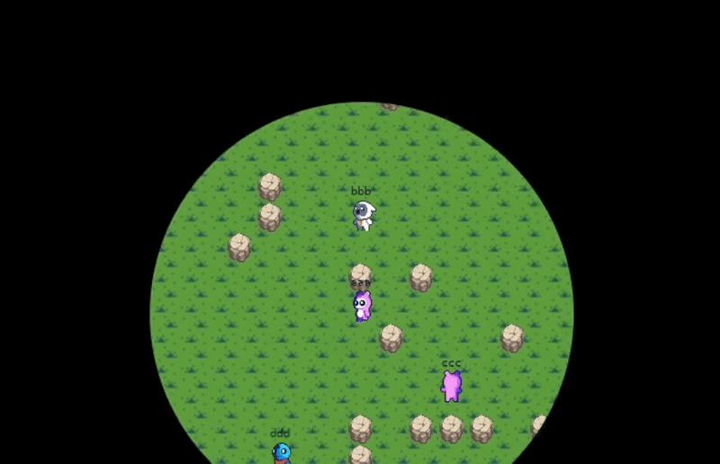

  
     
  

# Introduction

This is Animalized-client. Animalized is multi-player realtime battle simulation game.
You can play this client with [animalized-server](https://github.com/BJS-kr/animalized-server). Also, **Animalized** project is mainly focused on the server.
So, if you have interests in this project, please visit [animalized-server](https://github.com/BJS-kr/animalized-server).

# Build

1. Install [Wails](https://wails.io/docs/gettingstarted/installation) with Wails dependencies
2. Download repository
3. Install JS dependencies
4. Build using "wails build" command

# Game Rules

1. You can fire a fireball with key "a"
2. You can move characters using arrow keys
3. Fireball can hit a character or a wall
4. Wall will be weakened as fireball hit the wall
5. If wall state reached "vulnerable", fireball can destroy the wall
6. If a user hit player with fireball 10 times, game will be end

# Implementation

1. This project uses [Wails](https://wails.io/)
2. This project uses [React](https://react.dev/), [Canvas](https://developer.mozilla.org/en-US/docs/Web/API/Canvas_API)

### Known issue

1. After game played, keydown event still remains, so keydown intercepted by that event.
   You can still write the room name but have to type multiple times.
2. When build target is Windows, in-game screen does not shows up.

I did not fixed these issues because this client is just for POC.
